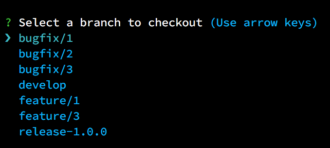

# Checkmeout

Provides a CLI list interface to make moving from (git) branch to (git) branch easy.

## Installation

```bash
npm install -g checkmeout
```

## Usage

Navigate to a directory that contains a `.git` directory.

```bash
checkmeout
```

Select the branch you'd like to move to



And your done!

## License

[MIT](LICENSE)
